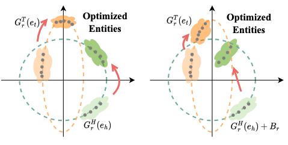
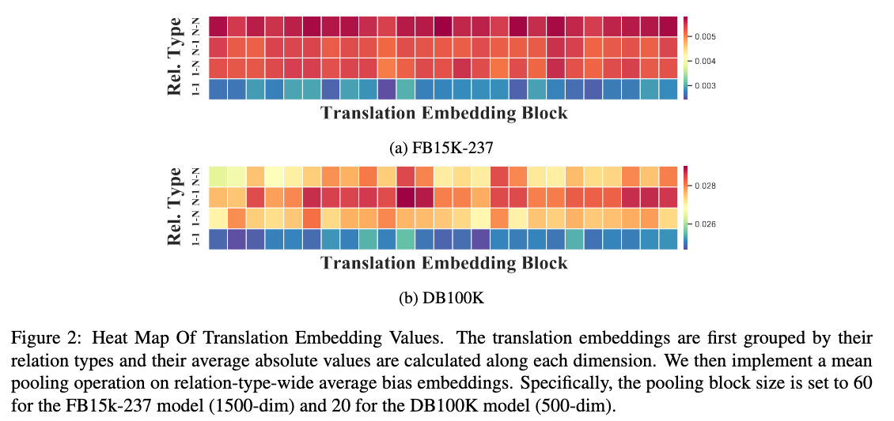
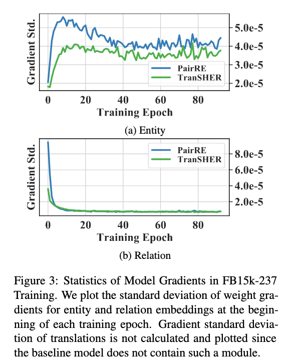
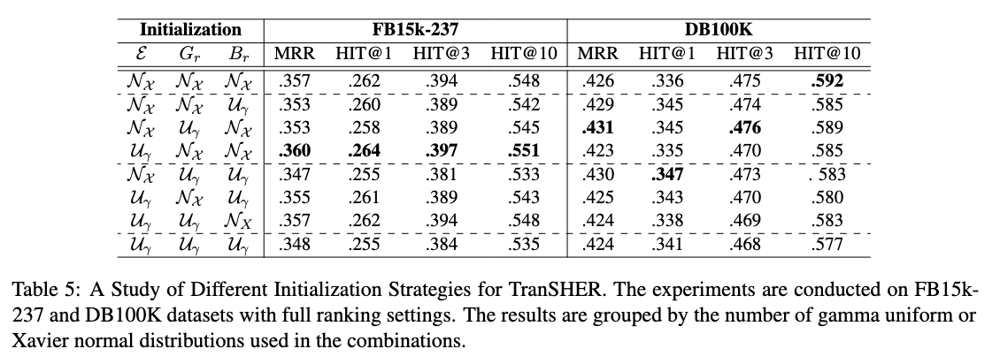
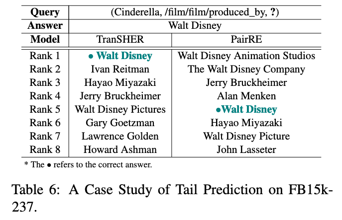

# TranSHER

Codes for the paper [TranSHER: Translating Knowledge Graph Embedding with Hyper-Ellipsoidal Restriction](https://arxiv.org/abs/2204.13221) accepted by the EMNLP 2022.



# Preparation

## Environment Setup

Environment can be easily set up by the following commands:

```shell
# create python virtual environment, recommending using conda
conda create -n TranSHER python=3.8
conda activate TranSHER
conda install pytorch torchvision torchaudio pytorch-cuda=11.6 -c pytorch -c nvidia
conda install -c conda-forge scikit-learn
```

Our codes are adapted from the [RotatE](https://github.com/DeepGraphLearning/KnowledgeGraphEmbedding) and [PairRE](https://github.com/alipay/KnowledgeGraphEmbeddingsViaPairedRelationVectors_PairRE) code bases, the environment requirements should be compatible.

## Dataset

All the full-ranking datasets are contained in the repo `[path to project]/data/`. You can put provide your own customized dataset by adding processed data at the folder.

The OGB link prediction datasets can be referred to the [OGB official repo](https://github.com/snap-stanford/ogb).

The main difference between the full-ranking datasets and the OGB link prediction dataset is that

-   the full-ranking datasets requires the model to retrieve matching entities from all the entity candidates, while
-   the OGB datasets only require model to retrieve the correct candidate from a small subset, since the entity quantity could be up to 2,500K.

# Experiments

## Full-ranking Datasets

The TranSHER results on those "classic" full-ranking dataset can be reproduced by the following commands. 

```shell
# FB15k-237
bash run.sh train TranSHER FB15k-237 0 0 1024 256 1500 6.0 1.0 0.00005 100000 16 -dr -r 0.00005

# DB100K
bash run.sh train TranSHER DB100K 0 0 1024 256 500 10.0 1.0 0.00005 150000 8 -dr -r 0.00001

# YAGO37
bash run.sh train TranSHER YAGO37 0 0 1024 256 500 14.0 1.0 0.00005 150000 8 -dr -r 0.00001
```

The default initialization strategies are set as `U_N_N'` for TranSHER, i.e. uniform distribution for the entity embeddings and Xavier Normal for the relation and translation embeddings.

By adding parameters like `'-ci U_N_N'` to the end of shell script, you can modify the initialization strategy for different components of the model.

## OGB Link Prediction

The experiments by adding TranSHER score function to the OGB codes in [PairRE](https://github.com/alipay/KnowledgeGraphEmbeddingsViaPairedRelationVectors_PairRE).

```python
def TranSHER(self, head, relation, tail, mode):
  re_head, re_tail, rel_bias = torch.chunk(relation, 3, dim=2)

  head = F.normalize(head, 2, -1)
  tail = F.normalize(tail, 2, -1)

  score = head * re_head + rel_bias - tail * re_tail

  score = self.gamma.item() - torch.norm(score, p=1, dim=2)
  return score
```

## Analysis Experiments

TBD

-   [ ] relation-specific translation visualization
-   [ ] standard variance of gradients during training
-   [ ] initialization strategies
-   [x] case study

### Relation-specific Translation Visualization



#### Standard Variance of Training Gradients



### Initialization Strategies



### Case Study




# Citation 

For the arxiv version:

```shell
@article{li2022transher,
  title={TransHER: Translating Knowledge Graph Embedding with Hyper-Ellipsoidal Restriction},
  author={Li, Yizhi and Fan, Wei and Liu, Chao and Lin, Chenghua and Qian, Jiang},
  journal={arXiv preprint arXiv:2204.13221},
  year={2022}
}
```